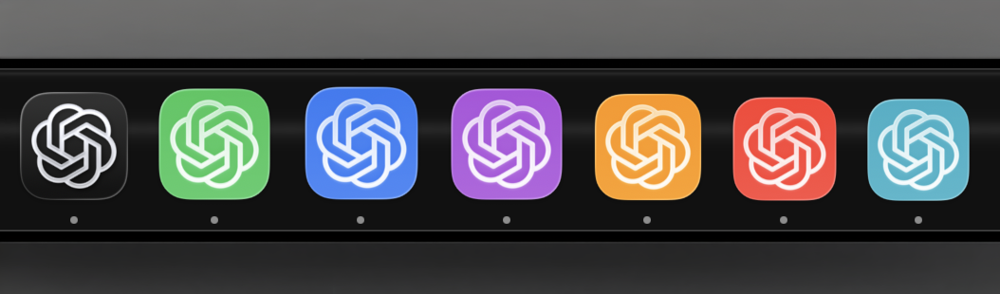

# MultiCodex

**Multiple Codex accounts. One Mac. Update Codex, run `sync`, keep working.**

MultiCodex lets you run multiple instances of the official Codex desktop app side by side. Give work, personal, or client accounts their own app name, colored icon, sign-in, and local profile—without repeatedly signing in and out.



[Quick start](#quick-start) · [Features](#what-you-get) · [Updates](#updating) · [Commands](#commands) · [Troubleshooting](docs/TROUBLESHOOTING.md)

## Why MultiCodex exists

I built MultiCodex because I needed it. Codex Router stopped working for my setup, and after reaching out to its developer without hearing back, I decided to build a tool I could use myself.

My priority was simple: **running multiple Codex accounts should not mean waiting for a matching tool release whenever Codex updates.**

MultiCodex builds your profiles from the official app already installed on your Mac. It changes the copies' names, icons, and bundle identifiers, then re-signs them locally. It does not patch Codex's JavaScript or maintain a modified version of its application code.

For ordinary updates, update the official app and run:

```sh
multicodex sync
```

Your profiles are rebuilt from the new app, keeping their account data and colors. There is no separate MultiCodex compatibility release to install for each routine Codex update.

This is an alternative for people who need **multiple desktop accounts running at once**. The Codex Router story above describes my experience, not a claim about every project with that name or its current status. MultiCodex still depends on the app's bundle layout and profile environment variables; an upstream change to those mechanisms may require a MultiCodex update.

## What you get

- **Accounts side by side.** Keep work, personal, and client sessions open at the same time.
- **Launch all your profiles.** `multicodex launch --all` starts them in sequence, skips apps already running, and reports startup failures.
- **Separate local profiles.** Each instance has its own Codex home and Electron data directory for credentials, settings, and local session state.
- **Apps you can tell apart.** Names such as `Codex work` and `Codex personal`, distinct Dock and Cmd-Tab entries, and ten colored icons.
- **Simple updates.** Sync every profile or just one. Version and build checks flag profiles that need rebuilding, including updates with the same display version.
- **Efficient copies on APFS.** Copy-on-write cloning can share unchanged app data with the source. Actual space and speed depend on your filesystem, app size, and subsequent changes; other filesystems fall back to full copies.
- **Local profile management.** No MultiCodex account, hosted backend, telemetry, or request proxy. MultiCodex manages files and launches apps on your Mac.
- **Separate macOS app identities.** Each profile has its own bundle identifier. macOS may ask for privacy permissions per profile; a suitable signing certificate helps keep grants stable across rebuilds.
- **A small tool you can inspect.** Bash and built-in macOS utilities. Generated icons are included; Python is only needed if you want to regenerate them.

Use it when you want to keep account contexts separate, recognize the right window at a glance, or work across several accounts without a sign-out/sign-in loop. MultiCodex does not add account quota, route requests to other model providers, or change what your accounts can access.

## Quick start

### Requirements

- **A Mac supported by the official Codex desktop app.** The build used during development requires macOS 13+ and Apple silicon; newer official builds may change those requirements.
- Git to clone this repository. If needed, install Apple's command-line tools with `xcode-select --install`.
- The official Codex desktop app, or use `multicodex install` below.
- APFS is recommended for space-efficient copies. A code-signing certificate is optional; ad-hoc signing is the fallback.

### 1. Get MultiCodex

```sh
git clone https://github.com/mahdi-salmanzade/MultiCodex.git
cd MultiCodex
export PATH="$PWD/bin:$PATH"
multicodex --version
```

That adds the command for the current terminal. To keep it available in new terminals using the default macOS zsh shell, run this **from the repository directory**:

```sh
printf '\nexport PATH="%s/bin:$PATH"\n' "$PWD" >> ~/.zshrc
source ~/.zshrc
```

Keep the cloned folder in place: the CLI reads its icons from `assets/icons` beside `bin`. You can also run `./bin/multicodex` from the repository without changing `PATH`.

### 2. Install or select the official app

If it is already installed at `/Applications/ChatGPT.app`, skip this step. That is the default bundle path used by this tool for the Codex app.

```sh
multicodex install
```

The installer downloads from OpenAI, verifies the app's signature, signing team, and bundle identifier before installing, and may request an administrator password to write to `/Applications`.

If your Codex app lives somewhere else, set its path before using MultiCodex:

```sh
export MULTICODEX_APP="/Applications/Codex.app"
```

Use the actual path on your Mac and keep this setting consistent across commands. See [configuration](#configuration) for persistence.

### 3. Create and launch your accounts

```sh
multicodex create work --color blue
multicodex create personal --color green

multicodex launch work
multicodex launch personal
```

Sign in to the intended account in each window. Both can stay open together. Omit `--color` to automatically pick an unused color.

Next time, start all your profiles with one command:

```sh
multicodex launch --all
```

Profiles start in sequence to avoid competing during startup. Already running profiles are skipped; each new app is given up to 30 seconds to appear as a running process. This checks process startup, not successful sign-in.

**Launch a profile however you like.** `multicodex launch <name>`, Finder, Spotlight, or a pinned Dock icon all work: each profile app carries its own isolation settings internally, so it opens its own account whichever way it is started. Once launched, use the Dock or Cmd-Tab to switch between running windows.

Profiles created before 1.0.1 predate that launcher. Rebuild them once so Dock and Spotlight launches work:

```sh
multicodex sync --force
```

```sh
multicodex list
multicodex doctor
```

`list` shows colors, whether a local `auth.json` exists, and update status. It does not validate the login with OpenAI. `doctor` reports the source app, signing identity, icon count, and filesystem information.

## Updating

### Update Codex

1. Quit the profile apps you intend to rebuild.
2. Update the official app using its updater, or quit it and run `multicodex install` to reinstall the latest download.
3. Sync and relaunch:

```sh
multicodex sync
multicodex launch work
```

Or update a single profile:

```sh
multicodex sync personal
```

Sync replaces the profile's application bundle. It preserves its name, color, bundle identifier, Codex home, and Electron data. Use the official source app for updates; use `sync` to propagate them to profiles. Creating or syncing profiles briefly restarts the Dock to refresh cached icons.

### Update MultiCodex itself

When you want fixes or features in this tool, run from your cloned repository:

```sh
git pull --ff-only
multicodex --version
```

There is no build step. Updating MultiCodex and updating the official app are separate operations.

## Commands

| Command | What it does |
| --- | --- |
| `multicodex install` | Download, verify, and install the official app. Asks before reinstalling an existing copy. |
| `multicodex create <name> [--color <color>]` | Create an isolated profile and its branded, locally re-signed app. |
| `multicodex launch <name>` | Launch with the profile's isolation settings. |
| `multicodex launch --all` | Start every profile in sequence, skipping those already running. Aliases: `launch -a`, `open-all`, `openall`. |
| `multicodex list` | Show profiles, colors, local auth-file presence, and sync status. Alias: `ls`. |
| `multicodex sync [name]` | Rebuild stale or missing profile apps from the installed source app. |
| `multicodex repair <name> [--from /old/profile/home]` | Restore access to sessions after moving a profile; defaults to the old `~/.codex-profiles/<name>` location. |
| `multicodex sessions sync <name> [--with <peer>]` | Sync conversations and message history both ways with `default` Codex or a named peer. Requires Python 3. |
| `multicodex sessions enable <name> [--with <peer>]` | Sync now and install a local agent that repeats every 15 seconds and at login. |
| `multicodex sessions disable <name> [--with <peer>]` | Stop the pair's automatic sync, retaining conversations and backups. |
| `multicodex sessions status <name> [--with <peer>]` | Show whether the agent is loaded, the last successful sync, and any last-attempt error. |
| `multicodex remove <name>` | Permanently delete the profile app and its local data after you type the profile name to confirm. Alias: `rm`. |
| `multicodex colors` | List the ten colors. Alias: `colours`. |
| `multicodex doctor` | Report installation, signing, icons, and filesystem details. |
| `multicodex --help` | Show usage. |
| `multicodex --version` | Show the MultiCodex version. |

Profile names accept letters, digits, dots, underscores, and hyphens; `.` and `..` are invalid. Use simple names such as `work`, `personal`, or `client-one`.

**Colors:** blue, green, purple, orange, red, teal, pink, yellow, indigo, graphite. Once all colors are used, automatic selection falls back to blue.

## On-device management and privacy

MultiCodex performs cloning, branding, signing, profile storage, and launching on your Mac. It does not send your credentials or conversations to a MultiCodex service. The `install` command accesses OpenAI's download server.

**Codex itself still connects to OpenAI and any services you configure.** Local profile management does not mean offline AI inference or that Codex never sends data over the network. Separate profiles are account and application-state separation, not operating-system sandboxes: they still run as your macOS user and can access files according to their permissions.

| Default location | Contents |
| --- | --- |
| `/Applications/ChatGPT.app` | Official source app. |
| `~/Applications/Codex <name>.app` | Profile app, created locally from the source. |
| `~/.multicodex/profiles/<name>` | Profile's Codex home, including credentials and local session data. |
| `~/Library/Application Support/MultiCodex/<name>` | Profile's Electron data. |
| `~/.codex` | Default Codex home, shown as `default` in the list. Profile commands do not modify it. |

Back up profile data before removing a profile. `remove` deletes its local credentials, conversations, settings, and app; it does not delete the account at OpenAI.

When launching a moved profile, MultiCodex checks its conversation index for old `~/.codex-profiles/<name>` paths. If a referenced session exists in the current home, it restores the old location with a compatibility symlink. Existing directories and conflicting links are preserved. This check uses macOS's `sqlite3`; if unavailable, use `repair` explicitly. See [session path recovery](docs/TROUBLESHOOTING.md#a-conversation-fails-with-failed-to-resolve-rollout-path).

### Optional shared conversations

Profiles have separate conversation stores by default. To share Default Codex and a `work` profile on the same Mac:

```sh
multicodex sessions enable work
multicodex sessions status work
```

New conversations, message history, titles, archive state, project records, and section assignments sync in both directions. Use `--with personal` to select another named profile instead of Default Codex. Account credentials, settings, remote-control enrollment, scheduled jobs, and other account state remain separate. Stop automatic sync with `multicodex sessions disable work`.

The first run backs up both conversation indexes and message-history databases under `~/.multicodex/session-sync`. It then merges an explicit set of conversation tables using SQLite transactions. Both profiles reference the original session files by absolute path; keep both profile homes in place. The helper does not copy the potentially large rollout files. Existing history databases are copied into the backup, and missing history is imported into the peer, so the first sync needs additional disk space and may take longer.

Automatic sync runs through a macOS LaunchAgent while you are logged in. Keep Python 3 and this checkout's `tools` directory available. After the first import, reopen the app if its sidebar is cached. See [sync behavior and limitations](docs/TROUBLESHOOTING.md#shared-conversations-are-missing-or-out-of-date).

## Configuration

| Variable | Default | Purpose |
| --- | --- | --- |
| `MULTICODEX_APP` | `/Applications/ChatGPT.app` | Official source app; also the install destination. |
| `MULTICODEX_ROOT` | `~/.multicodex/profiles` | Root of profile Codex homes. Changing it does not migrate existing data. |
| `MULTICODEX_ICONS` | Repository's `assets/icons` | Directory containing the ten `.icns` variants. |
| `MULTICODEX_SIGNING_IDENTITY` | Automatically selected | Prefer a Developer ID Application identity, then Apple Development; fall back to ad-hoc signing (`-`). |

Add needed `export` lines to `~/.zshrc` to reuse them in new terminals. Use the same configuration for creating, launching, syncing, and removing profiles.

Re-signing is necessary because changing app metadata invalidates the original signature. With ad-hoc signing, privacy grants may reset after a rebuild. A suitable team-backed identity helps preserve them, but macOS can still ask for authorization. See [troubleshooting](docs/TROUBLESHOOTING.md).

## How it works

1. Clone the installed official application, using APFS copy-on-write when available.
2. Set the profile's display name, bundle identifier (`local.multicodex.<name>`), and colored icon.
3. Remove `CFBundleIconName` so the app's asset catalog does not override the replacement `.icns`.
4. Give the copy a URL scheme of its own (`codex-<name>:`) and drop its claim on `codex:`, `http:` and `https:`.
5. Re-sign and verify the copy, then register it with Launch Services.
6. Launch with `CODEX_HOME`, `CODEX_ELECTRON_USER_DATA_PATH`, and `--user-data-dir` pointing at the profile's directories.

Step 4 matters more than it looks. macOS binds one application to each URL scheme, and the app claims `codex:` as it starts. A clone that inherited that claim would take every `codex://` link on the machine the moment it was launched — including the OAuth callback that finishes an MCP login, which would then open in whichever profile ran most recently rather than the one that began the login. Giving each profile a private scheme leaves `codex:` with the official app. `multicodex doctor` reports which application currently holds it.

Both environment variables matter. In the app behavior this tool was developed against, setting only `CODEX_HOME` can be overridden by the app's login-shell environment loading. The Electron data path keeps the profile configuration separate.

No OpenAI application bundle is included in this repository. Each user supplies or downloads the official app and creates their copies locally.

## Development and contributing

See [CONTRIBUTING.md](CONTRIBUTING.md) for checks, icon generation, and contribution guidance, and [CHANGELOG.md](CHANGELOG.md) for release notes. Report reproducible problems through [GitHub Issues](https://github.com/mahdi-salmanzade/MultiCodex/issues). For credential exposure or other security concerns, see [SECURITY.md](SECURITY.md).

```text
bin/multicodex          Bash CLI
assets/icons/          Ten generated profile icons
assets/electron.icns   Source artwork for icon generation
icons.png              README Dock preview
tools/make_icons.py    Optional icon generator
tests/                 Isolated CLI regression tests
```

## License and credits

MultiCodex's original code and documentation are available under the [MIT License](LICENSE). See [THIRD_PARTY_NOTICES.md](THIRD_PARTY_NOTICES.md) for the OpenAI-derived icon artwork and third-party names, which are not relicensed under MIT.

Created by [Mahdi Salmanzade](https://github.com/mahdi-salmanzade). MultiCodex is an independent community project and is not affiliated with or endorsed by OpenAI. Codex and ChatGPT are OpenAI products.
